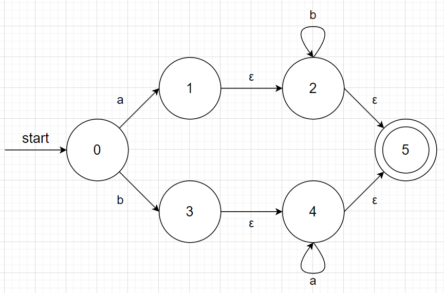

# CS323 Asignment 1

## Exercise 1

```java
int func(int x){
    int 1a = x;
}
```

```java
int func(int x){
    /* comment
    int 1a = x;
}
```

## Exercise 2

For string *s=aaaa*, we can let *x=aaaa*, which is both a prefix and a suffix of *s*, and *y=a*, which is both a proper prefix and a proper suffix of *s*.

## Exercise 3

1. Substring of length m: $n-m+1$

    A substring is consecutive in the original string. Starting from the first bit and shifting to next bit every time, there are n-m+1 substrings in total.

2. Subsequences: $2^n$
   
    For every bit of the string, there are 2 possible choices: choose it or not. Thus, there are $2^n$ subsequences for a string of length n.

## Exercise 4

* Regular Definition

```
country_code -> 86
hyphen -> -
area_code -> 755
digits -> [1...9][0...9][0...9][0...9][0...9][0...9][0...9][0...9]
valid_phone_number -> (country_code)(hyphen)(area_code)(hyphen)(digits)
```

* Regular Expression

```
86-755-[1...9][0...9][0...9][0...9][0...9][0...9][0...9][0...9]
```

## Exercise 5

No. For example, the string s = 10 is in the language $L_2$ but not in $L_1$.

## Exercise 6



No. We can explain it step by step:

1. input b, then transit to status 3;
2. input ε, then transit to status 4;
3. input aa, still in status 4;
4. now the last b has no place to go.