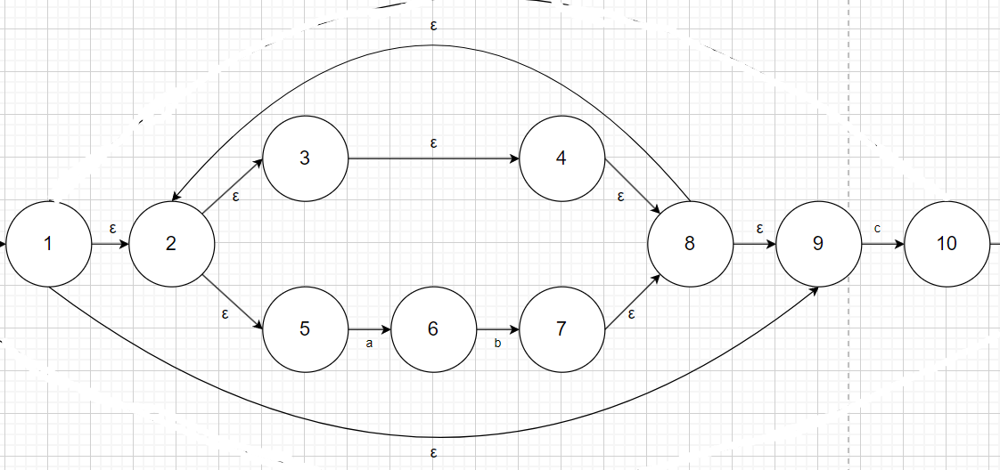
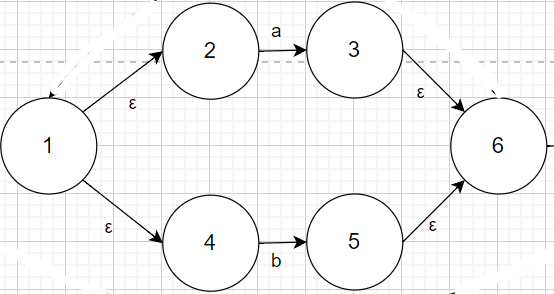

# CS323 Asignment 2

## Exercise 1

* NFA of `L(((ϵ|ab)*c)*)`

* NFA of `L((a|b)*a(b|c)(a|b|c))`

Both of them are not DFA.

## Exercise 2

### `L(((ϵ|ab)*c)*)`

1. Firstly, consider `l = (ϵ|ab)`.

By the inductive rule: the union case, we have

where the state transition of 5 -> 6 -> 7 uses the inductive rule: the concatenation case.

2. Secondly, consider `l' = l*`

By the inductive rule: the Kleene star case, we have

3. Thirdly, consider `l'' = l'c`

By the inductive rule: the concatenation case, we have

4. Fourthly, consider `l''' = l''*`

### `L((a|b)*a(b|c)(a|b|c))`

1. Firstly, consider `l = (a|b)`

By the inductive rule: the union case, we have

2. Secondly, consider `l' = l*`

By the inductive rule: the Kleene star case, we have

3. Thirdly, consider `l'' = (b|c)` and `l''' = (a|b|c)`

By the inductive rule: the union case, we have

and

4. Fourthly, consider `l'''' = l'al''l'''`

By the inductive rule: the concatenation case, we have

## Exercise 3

### `L(((ϵ|ab)*c)*)`

Σ = {a, b, c}

1. A = ϵ-closure(0) = {0, 1, 2, 5, 3, 4, 8, 9, 11}

2. ϵ-closure(move[A, a]) = ϵ-closure({6}) = {6}, which is an unseen state, named B.

3. ϵ-closure(move[A, b]) = ϵ-closure({}) = {}

4. ϵ-closure(move[A, c]) = ϵ-closure({10}) = {10, 11, 1, 2, 5, 3, 4, 8, 9}, which is an unseen state, named C.

5. ϵ-closure(move[B, a]) = ϵ-closure({}) = {}

6. ϵ-closure(move[B, b]) = ϵ-closure({7}) = {7, 8, 9, 2, 5, 3, 4}, which is an unseen state, named D.

7. ϵ-closure(move[B, c]) = ϵ-closure({}) = {}

8. ϵ-closure(move[C, a]) = ϵ-closure({6}) = {6} = B

9. ϵ-closure(move[C, b]) = ϵ-closure({}) = {}

10. ϵ-closure(move[C, c]) = ϵ-closure({10}) = {10, 11, 1, 2, 3, 4, 8, 9, 5} = C

11. ϵ-closure(move[D, a]) = ϵ-closure({6}) = {6} = B

12. ϵ-closure(move[D, b]) = ϵ-closure({}) = {}

13. ϵ-closure(move[D, c]) = ϵ-closure({10}) = {10, 11, 1, 2, 5, 3, 4, 8, 9} = C

Above all, we have the following transition table.

* Start state: A, Accepting states: A, C

| NFA state | DFA state | a | b | c |
|---|---|---|---|---|
| {0, 1, 2, 5, 3, 4, 8, 9, 11} | A | B |  | C |
| {6} | B |  | D |  |
| {10, 11, 1, 2, 5, 3, 4, 8, 9} | C | B |  | C |
| {7, 8, 9, 2, 5, 3, 4} | D | B |  | C |

So the DFA is as below.

### `L((a|b)*a(b|c)(a|b|c))`

Σ = {a, b, c}

1. A = ϵ-closure(0) = {0, 1, 2, 4, 7}

2. ϵ-closure(move[A, a]) = ϵ-closure({3, 8}) = {3, 6, 7, 1, 2, 4, 8, 9, 11}, which is an unseen state, named B.

3. ϵ-closure(move[A, b]) = ϵ-closure({5}) = {5, 6, 7, 1, 2, 4}, which is an unseen state, named C.

4. ϵ-closure(move[A, c]) = ϵ-closure({}) = {}

5. ϵ-closure(move[B, a]) = ϵ-closure({3, 8}) = {3, 6, 7, 1, 2, 4, 8, 9, 11} = B

6. ϵ-closure(move[B, b]) = ϵ-closure({5, 10}) = {5, 6, 7, 1, 2, 4, 10, 13, 14, 16, 18}, which is an unseen state, named D.

7. ϵ-closure(move[B, c]) = ϵ-closure({12}) = {12, 13, 14, 16, 18}, which is an unseen state, named E.

8. ϵ-closure(move[C, a]) = ϵ-closure({3, 8}) = {3, 6, 7, 1, 2, 4, 8, 9, 11} = B.

9. ϵ-closure(move[C, b]) = ϵ-closure({5}) = {5, 6, 7, 1, 2, 4} = C

10. ϵ-closure(move[C, c]) = ϵ-closure({}) = {}

11. ϵ-closure(move[D, a]) = ϵ-closure({3, 8, 15}) = {3, 6, 7, 1, 2,4, 8, 9, 11, 15, 20}, which is an unseen state, named F.

12. ϵ-closure(move[D, b]) = ϵ-closure({5, 17}) = {5, 6, 7, 1, 2, 4, 17, 20}, which is an unseen state, named G.

13. ϵ-closure(move[D, c]) = ϵ-closure({19}) = {19, 20}, which is an unseen state, named H.

14. ϵ-closure(move[E, a]) = ϵ-closure({15}) = {15, 20}, which is an unseen state, named I.

15. ϵ-closure(move[E, b]) = ϵ-closure({17}) = {17, 20}, which is an unseen state, named J.

16. ϵ-closure(move[E, c]) = ϵ-closure({19}) = {19, 20} = H

17. ϵ-closure(move[F, a]) = ϵ-closure({3, 8}) = {3, 6, 7, 1, 2, 4, 8, 9, 11} = B.

18. ϵ-closure(move[F, b]) = ϵ-closure({5, 10, 17}) = {5, 6, 7, 1, 2, 4, 10, 13, 14, 16, 18, 17, 20}, which is an unseen state, named K.

19. ϵ-closure(move[F, c]) = ϵ-closure({12}) = {12, 13, 14, 16, 18} = E

20. ϵ-closure(move[G, a]) = ϵ-closure({3, 8}) = {3, 6, 7, 1, 2, 4, 8, 9, 11} = B.

21. ϵ-closure(move[G, b]) = ϵ-closure({5}) = {5, 6, 7, 1, 2, 4} = C

22. ϵ-closure(move[G, c]) = ϵ-closure({}) = {}

23. ϵ-closure(move[H, a]) = ϵ-closure({}) = {}

24. ϵ-closure(move[H, b]) = ϵ-closure({}) = {}

25. ϵ-closure(move[H, c]) = ϵ-closure({}) = {}

26. ϵ-closure(move[I, a]) = ϵ-closure({}) = {}

27. ϵ-closure(move[I, b]) = ϵ-closure({}) = {}

28. ϵ-closure(move[I, c]) = ϵ-closure({}) = {}

29. ϵ-closure(move[J, a]) = ϵ-closure({}) = {}

30. ϵ-closure(move[J, b]) = ϵ-closure({}) = {}

31. ϵ-closure(move[J, c]) = ϵ-closure({}) = {}

32. ϵ-closure(move[K, a]) = ϵ-closure({3, 8, 15}) = {3, 6, 7, 1, 2,4, 8, 9, 11, 15, 20} = F

33. ϵ-closure(move[K, b]) = ϵ-closure({5, 17}) = {5, 6, 7, 1, 2, 4, 17, 20} = G

34. ϵ-closure(move[K, c]) = ϵ-closure({19}) = {19, 20} = H

Above all, we have the following transition table.

* Start state: A, Accepting states: F, G, H, I, J, K

| NFA state | DFA state | a | b | c |
|---|---|---|---|---|
| {0, 1, 2, 4, 7} | A | B | C |  |
| {3, 6, 7, 1, 2, 4, 8, 9, 11} | B | B | D | E |
| {5, 6, 7, 1, 2, 4} | C | B | C |  |
| {5, 6, 7, 1, 2, 4, 10, 13, 14, 16, 18} | D | F | G | H |
| {12, 13, 14, 16, 18} | E | I | J | H |
| {3, 6, 7, 1, 2,4, 8, 9, 11, 15, 20} | F | B | K | E |
| {5, 6, 7, 1, 2, 4, 17, 20} | G | B | C |  |
| {19, 20} | H |  |  |  |
| {15, 20} | I |  |  |  |
| {17, 20} | J |  |  |  |
| {5, 6, 7, 1, 2, 4, 10, 13, 14, 16, 18, 17, 20} | K | F | G | H |

So the DFA is as below.

