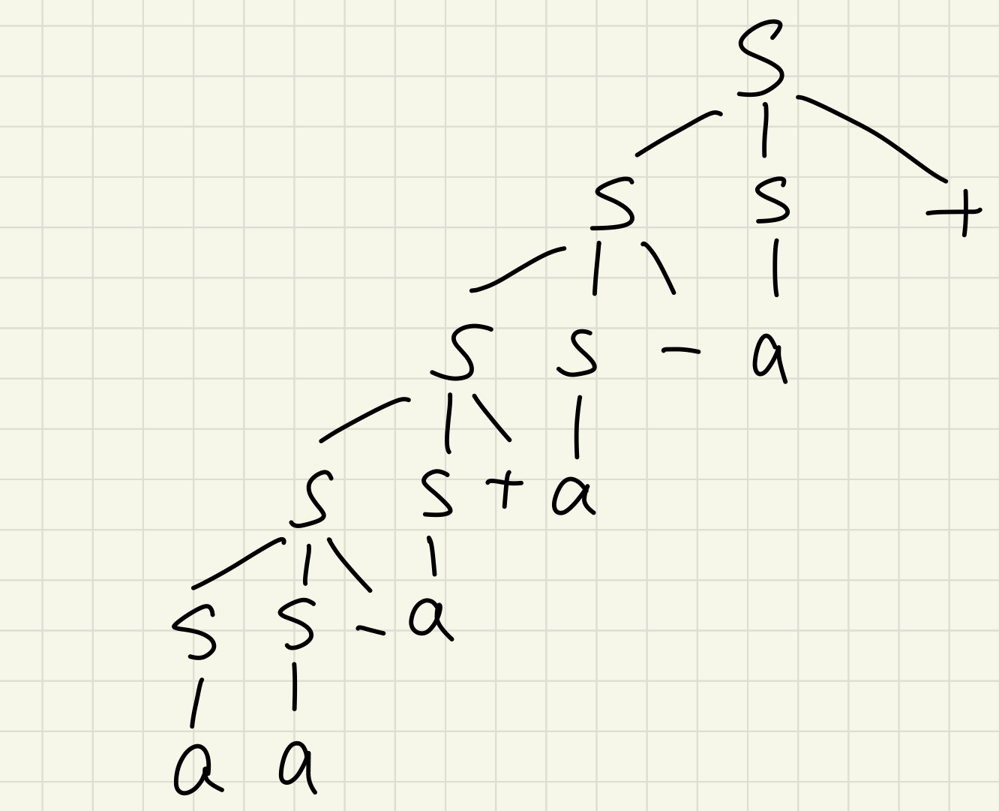
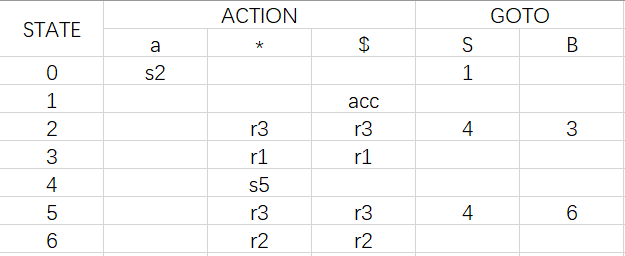
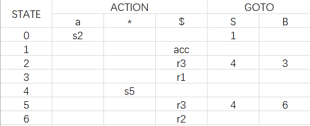

# CS323 Asignment 3

## Exercise 1

1. The string "a+a-a" is NOT a valid sentence in $L(G)$ since

$$
a+a-a\impliedby S+a-a\impliedby S+S-a\impliedby S+S-S
$$

And there is no derivation can apply to the sentence.

2. The leftmost derivation is as below:

$$
S\implies SS+\implies SS-S+\implies SS+S-S+ \\
\implies SS-S+S-S+\implies aS-S+S-S+\implies aa-S+S-S+ \\
\implies aa-a+S-S+\implies aa-a+a-S+\implies aa-a+a-a+
$$

3. The rightmost derivation is as below:

$$
S\implies SS+\implies Sa+\implies SS-a+ \\
\implies Sa-a+\implies SS+a-a+\implies Sa+a-a+ \\
\implies SS-a+a-a+\implies Sa-a+a-a+\implies aa-a+a-a+
$$

4. The parse tree is as below:

## Exercise 2

1. 

Since $S\rightarrow aB$, then $a\in FIRST(S)$. Since $B\rightarrow S*B|\epsilon$ and $S\rightarrow aB$, then $a\in FIRST(B), \epsilon\in FIRST(B)$. So

$$
FIRST(S) = \{a\}, \\
FIRST(B) = \{a,\epsilon\}
$$

Add $\$$ into $FOLLOW(S)$ and $FOLLOW(B)$. Since $S\rightarrow aB$, then $FOLLOW(S)\subset FOLLOW(B)$ except $\epsilon$. Since $B\rightarrow S*B|\epsilon$, then $*\in FOLLOW(S)$. So

$$
FOLLOW(S) = \{\$,*\}, \\
FOLLOW(B) = \{\$,*\}
$$

For $S\rightarrow aB$, $FIRST(aB)=FIRST(a)=\{a\}$

For $B\rightarrow S*B$, $FIRST(S*B)=FIRST(S)=\{a\}$

For $B\rightarrow\epsilon$, $FIRST(\epsilon)=\{\epsilon\}$, then $FOLLOW(B)=\{\$,*\}$

The predictive parsing table is as below:

| NON-TERMINAL | a                  | *                      | $                      |
| ------------ | ------------------ | ---------------------- | ---------------------- |
| S            | $S\rightarrow aB$  |                        |                        |
| B            | $B\rightarrow S*B$ | $B\rightarrow\epsilon$ | $B\rightarrow\epsilon$ |

2. The grammar is LL(1) since there is no entries with multiple productions.

3. Yes.

Input: string $aaaa***$, the parsing table $M$. The steps is as below.

| MATCHED | STACK       | INPUT    | ACTION                        |
| ------- | ----------- | -------- | ----------------------------- |
|         | S$          | aaaa***$ |                               |
|         | aB$         | aaaa***$ | output  $S\rightarrow aB$     |
| a       | B$          | aaa***$  | match a                       |
| a       | S*B$        | aaa***$  | output    $B\rightarrow S*B$  |
| a       | aB*B$       | aaa***$  | output  $S\rightarrow aB$     |
| aa      | B*B$        | aa***$   | match a                       |
| aa      | S\*B*B$     | aa***$   | output    $B\rightarrow S*B$  |
| aa      | aB\*B*B$    | aa***$   | output  $S\rightarrow aB$     |
| aaa     | B\*B*B$     | a***$    | match a                       |
| aaa     | S\*B\*B*B$  | a***$    | output    $B\rightarrow S*B$  |
| aaa     | aB\*B\*B*B$ | a***$    | output  $S\rightarrow aB$     |
| aaaa    | B\*B\*B*B$  | ***$     | match a                       |
| aaaa    | \*B\*B*B$   | ***$     | output $B\rightarrow\epsilon$ |
| aaaa*   | B\*B*B$     | **$      | match *                       |
| aaaa*   | \*B*B$      | **$      | output $B\rightarrow\epsilon$ |
| aaaa**  | B*B$        | *$       | match *                       |
| aaaa**  | *B$         | *$       | output $B\rightarrow\epsilon$ |
| aaaa*** | B$          | $        | match *                       |
| aaaa*** | $           | $        | output $B\rightarrow\epsilon$ |

## Exercise 3

Grammar $G$ (code the derivations):

$$
(1) S\rightarrow aB \\
(2) B\rightarrow S*B \\
(3) B\rightarrow\epsilon
$$

Augmented grammar $G'$:

$$
S'\rightarrow S \\
S\rightarrow aB \\
B\rightarrow S*B|\epsilon
$$

Items:

$$
S'\rightarrow\cdot S, S'\rightarrow S\cdot \\
S\rightarrow\cdot aB, S\rightarrow a\cdot B, S\rightarrow aB\cdot \\
B\rightarrow\cdot S*B, B\rightarrow S\cdot *B, B\rightarrow S*\cdot B, B\rightarrow S*B\cdot \\
B\rightarrow\cdot
$$

$FIRST$ and $FOLLOW$:

$$
FIRST(S) = \{a\}, \\
FIRST(B) = \{a,\epsilon\}; \\
FOLLOW(S) = \{\$,*\}, \\
FOLLOW(B) = \{\$,*\}
$$

1. 
(1) SLR

Calculation of canonical LR(0) collection:

* Initial state: $C=\{I_0\}=\{CLOSURE(\{[S'\rightarrow\cdot S]\})\}=\{[S'\rightarrow\cdot S], [S\rightarrow\cdot aB]\}$.

* Iteration for item set $I_0=\{[S'\rightarrow\cdot S], [S\rightarrow\cdot aB]\}$:
    * for grammar symbol $S$, $GOTO(I_0,S)=CLOSURE(\{[S'\rightarrow S\cdot]\})=\{[S'\rightarrow S\cdot]\}$, which is not in $C$ and thus named $I_1$ and added into $C$.
    * for grammar symbol $a$, $GOTO(I_0,a)=CLOSURE(\{[S\rightarrow a\cdot B]\})=\{[S\rightarrow a\cdot B],[B\rightarrow\cdot S*B],[B\rightarrow\cdot]\}$, which is not in $C$ and thus named $I_2$ and added into $C$.

* Iteration for item set $I_1=\{[S'\rightarrow S\cdot]\}$:
    * No $GOTO$

* Iteration for item set $I_2=\{[S\rightarrow a\cdot B],[B\rightarrow\cdot S*B],[B\rightarrow\cdot]\}$
    * for grammar symbol $B$, $GOTO(I_2,B)=CLOSURE(\{[S\rightarrow aB\cdot]\})=\{[S\rightarrow aB\cdot]\}$, which is not in $C$ and thus named $I_3$ and added into $C$.
    * for grammar symbol $S$, $GOTO(I_2,S)=CLOSURE(\{[B\rightarrow S\cdot *B]\})=\{[B\rightarrow S\cdot *B]\}$, which is not in $C$ and thus named $I_4$ and added into $C$.

* Iteration for item set $I_3=\{[S\rightarrow aB\cdot]\}$:
    * No $GOTO$

* Iteration for item set $I_4=\{[B\rightarrow S\cdot *B]\}$
    * for grammar symbol $*$, $GOTO(I_4,*)=CLOSURE(\{[B\rightarrow S*\cdot B]\})=\{[B\rightarrow S*\cdot B],[B\rightarrow\cdot S*B],[B\rightarrow\cdot]\}$, which is not in $C$ and thus named $I_5$ and added into $C$.

* Iteration for item set $I_5=\{[B\rightarrow S*\cdot B],[B\rightarrow\cdot S*B],[B\rightarrow\cdot]\}$
    * for grammar symbol $B$, $GOTO(I_5,B)=CLOSURE(\{[B\rightarrow S*B\cdot]\})=\{[B\rightarrow S*B\cdot]\}$, which is not in $C$ and thus named $I_6$ and added into $C$.
    * for grammar symbol $S$, $GOTO(I_5,S)=CLOSURE(\{[B\rightarrow S\cdot *B]\})=\{[B\rightarrow S\cdot *B]\}=I_4$

* Iteration for item set $I_6=\{[B\rightarrow S*B\cdot]\}$
    * No $GOTO$

After all, the canonical LR(0) collection is as below:

| SET   | ITEMS                                                                  |
| ----- | ---------------------------------------------------------------------- |
| $I_0$ | $[S'\rightarrow\cdot S],[S\rightarrow\cdot aB]$                        |
| $I_1$ | $[S'\rightarrow S\cdot]$                                               |
| $I_2$ | $[S\rightarrow a\cdot B],[B\rightarrow\cdot S*B],[B\rightarrow\cdot]$  |
| $I_3$ | $[S\rightarrow aB\cdot]$                                               |
| $I_4$ | $[B\rightarrow S\cdot *B]$                                             |
| $I_5$ | $[B\rightarrow S*\cdot B],[B\rightarrow\cdot S*B],[B\rightarrow\cdot]$ |
| $I_6$ | $[B\rightarrow S*B\cdot]$                                              |

And the function $GOTO$ is defined as below:

$$
GOTO(I_0,S)=I_1, GOTO(I_0,a)=I_2, \\
GOTO(I_2,B)=I_3, GOTO(I_2,S)=I_4, \\
GOTO(I_4,*)=I_5, \\
GOTO(I_5,B)=I_6, GOTO(I_5,S)=I_4
$$

For $accept$,

* Since $[S'\rightarrow S\cdot]\in I_1$, $ACTION[1,\$]=acc$.

For $shift$,

* Since $[S\rightarrow\cdot aB]\in I_0$ and $GOTO(I_0,a)=I_2$, $ACTION[0,a]=s2$.
* Since $[B\rightarrow S\cdot *B]\in I_4$ and $GOTO(I_4,*)=I_5$, $ACTION[4,*]=s5$.

For $reduce$,

* Since $[B\rightarrow\cdot]\in I_2$ and $FOLLOW(B)=\{\$,*\}$, $ACTION[2,\$]=ACTION[2,*]=reduce\ B\rightarrow\epsilon\ (r3)$.
* Since $[S\rightarrow aB\cdot]\in I_3$ and $FOLLOW(S)=\{\$,*\}$, $ACTION[3,\$]=ACTION[3,*]=reduce\ S\rightarrow aB\ (r1)$.
* Since $[B\rightarrow\cdot]\in I_5$ and $FOLLOW(B)=\{\$,*\}$, $ACTION[5,\$]=ACTION[5,*]=reduce\ B\rightarrow\epsilon\ (r3)$.
* Since $[B\rightarrow S*B\cdot]\in I_6$ and $FOLLOW(B)=\{\$,*\}$, $ACTION[6,\$]=ACTION[6,*]=reduce\ B\rightarrow S*B\ (r2)$.

Then we can construct the SLR parsing table:

(2) CLR

Calculation of canonical LR(1) collection:

* Initial state: $C=\{I_0\}=\{CLOSURE(\{[S'\rightarrow\cdot S, \$]\})\}=\{[S'\rightarrow\cdot S, \$], [S\rightarrow\cdot aB, \$]\}$.

* Iteration for item set $I_0=\{[S'\rightarrow\cdot S, \$], [S\rightarrow\cdot aB, \$]\}$:
    * for grammar symbol $S$, $GOTO(I_0,S)=CLOSURE(\{[S'\rightarrow S\cdot, \$]\})=\{[S'\rightarrow S\cdot, \$]\}$, which is not in $C$ and thus named $I_1$ and added into $C$.
    * for grammar symbol $a$, $GOTO(I_0,a)=CLOSURE(\{[S\rightarrow a\cdot B, \$]\})=\{[S\rightarrow a\cdot B, \$],[B\rightarrow\cdot S*B, \$],[B\rightarrow\cdot, \$]\}$, which is not in $C$ and thus named $I_2$ and added into $C$.

* Iteration for item set $I_1=\{[S'\rightarrow S\cdot, \$]\}$:
    * No $GOTO$

* Iteration for item set $I_2=\{[S\rightarrow a\cdot B, \$],[B\rightarrow\cdot S*B, \$],[B\rightarrow\cdot, \$]\}$
    * for grammar symbol $B$, $GOTO(I_2,B)=CLOSURE(\{[S\rightarrow aB\cdot, \$]\})=\{[S\rightarrow aB\cdot, \$]\}$, which is not in $C$ and thus named $I_3$ and added into $C$.
    * for grammar symbol $S$, $GOTO(I_2,S)=CLOSURE(\{[B\rightarrow S\cdot *B, \$]\})=\{[B\rightarrow S\cdot *B, \$]\}$, which is not in $C$ and thus named $I_4$ and added into $C$.

* Iteration for item set $I_3=\{[S\rightarrow aB\cdot, \$]\}$:
    * No $GOTO$

* Iteration for item set $I_4=\{[B\rightarrow S\cdot *B, \$]\}$
    * for grammar symbol $*$, $GOTO(I_4,*)=CLOSURE(\{[B\rightarrow S*\cdot B, \$]\})=\{[B\rightarrow S*\cdot B, \$],[B\rightarrow\cdot S*B, \$],[B\rightarrow\cdot, \$]\}$, which is not in $C$ and thus named $I_5$ and added into $C$.

* Iteration for item set $I_5=\{[B\rightarrow S*\cdot B, \$],[B\rightarrow\cdot S*B, \$],[B\rightarrow\cdot, \$]\}$
    * for grammar symbol $B$, $GOTO(I_5,B)=CLOSURE(\{[B\rightarrow S*B\cdot, \$]\})=\{[B\rightarrow S*B\cdot, \$]\}$, which is not in $C$ and thus named $I_6$ and added into $C$.
    * for grammar symbol $S$, $GOTO(I_5,S)=CLOSURE(\{[B\rightarrow S\cdot *B, \$]\})=\{[B\rightarrow S\cdot *B, \$]\}=I_4$

* Iteration for item set $I_6=\{[B\rightarrow S*B\cdot, \$]\}$
    * No $GOTO$

After all, the canonical LR(1) collection is as below:

| SET   | ITEMS                                                                              |
| ----- | ---------------------------------------------------------------------------------- |
| $I_0$ | $[S'\rightarrow\cdot S, \$],[S\rightarrow\cdot aB, \$]$                            |
| $I_1$ | $[S'\rightarrow S\cdot, \$]$                                                       |
| $I_2$ | $[S\rightarrow a\cdot B, \$],[B\rightarrow\cdot S*B, \$],[B\rightarrow\cdot, \$]$  |
| $I_3$ | $[S\rightarrow aB\cdot, \$]$                                                       |
| $I_4$ | $[B\rightarrow S\cdot *B, \$]$                                                     |
| $I_5$ | $[B\rightarrow S*\cdot B, \$],[B\rightarrow\cdot S*B, \$],[B\rightarrow\cdot, \$]$ |
| $I_6$ | $[B\rightarrow S*B\cdot, \$]$                                                      |

And the function $GOTO$ is defined as below:

$$
GOTO(I_0,S)=I_1, GOTO(I_0,a)=I_2, \\
GOTO(I_2,B)=I_3, GOTO(I_2,S)=I_4, \\
GOTO(I_4,*)=I_5, \\
GOTO(I_5,B)=I_6, GOTO(I_5,S)=I_4
$$

For $accept$,

* Since $[S'\rightarrow S\cdot, \$]\in I_1$, $ACTION[1,\$]=acc$.

For $shift$,

* Since $[S\rightarrow\cdot aB, \$]\in I_0$ and $GOTO(I_0,a)=I_2$, $ACTION[0,a]=s2$.
* Since $[B\rightarrow S\cdot *B, \$]\in I_4$ and $GOTO(I_4,*)=I_5$, $ACTION[4,*]=s5$.

For $reduce$,

* Since $[B\rightarrow\cdot, \$]\in I_2$, $ACTION[2,\$]=reduce\ B\rightarrow\epsilon\ (r3)$.
* Since $[S\rightarrow aB\cdot, \$]\in I_3$, $ACTION[3,\$]=reduce\ S\rightarrow aB\ (r1)$.
* Since $[B\rightarrow\cdot, \$]\in I_5$, $ACTION[5,\$]=reduce\ B\rightarrow\epsilon\ (r3)$.
* Since $[B\rightarrow S*B\cdot, \$]\in I_6$, $ACTION[6,\$]=reduce\ B\rightarrow S*B\ (r2)$.

Then we can construct the CLR parsing table:

(3) LALR

From the above, we can get the canonical LR(1) collection is as below:

| SET   | ITEMS                                                                              |
| ----- | ---------------------------------------------------------------------------------- |
| $I_0$ | $[S'\rightarrow\cdot S, \$],[S\rightarrow\cdot aB, \$]$                            |
| $I_1$ | $[S'\rightarrow S\cdot, \$]$                                                       |
| $I_2$ | $[S\rightarrow a\cdot B, \$],[B\rightarrow\cdot S*B, \$],[B\rightarrow\cdot, \$]$  |
| $I_3$ | $[S\rightarrow aB\cdot, \$]$                                                       |
| $I_4$ | $[B\rightarrow S\cdot *B, \$]$                                                     |
| $I_5$ | $[B\rightarrow S*\cdot B, \$],[B\rightarrow\cdot S*B, \$],[B\rightarrow\cdot, \$]$ |
| $I_6$ | $[B\rightarrow S*B\cdot, \$]$                                                      |

And the function $GOTO$ is defined as below:

$$
GOTO(I_0,S)=I_1, GOTO(I_0,a)=I_2, \\
GOTO(I_2,B)=I_3, GOTO(I_2,S)=I_4, \\
GOTO(I_4,*)=I_5, \\
GOTO(I_5,B)=I_6, GOTO(I_5,S)=I_4
$$

Combining the canonical LR(1) collection, we can get the new LR(1) collection as (actually there is no need to combine)

| SET   | ITEMS                                                                              |
| ----- | ---------------------------------------------------------------------------------- |
| $I_0$ | $[S'\rightarrow\cdot S, \$],[S\rightarrow\cdot aB, \$]$                            |
| $I_1$ | $[S'\rightarrow S\cdot, \$]$                                                       |
| $I_2$ | $[S\rightarrow a\cdot B, \$],[B\rightarrow\cdot S*B, \$],[B\rightarrow\cdot, \$]$  |
| $I_3$ | $[S\rightarrow aB\cdot, \$]$                                                       |
| $I_4$ | $[B\rightarrow S\cdot *B, \$]$                                                     |
| $I_5$ | $[B\rightarrow S*\cdot B, \$],[B\rightarrow\cdot S*B, \$],[B\rightarrow\cdot, \$]$ |
| $I_6$ | $[B\rightarrow S*B\cdot, \$]$                                                      |

Then we can construct the LALR parsing table:

2. The grammar is SLR(1), LR(1) and LALR(1). All because it can construct the parsing table and there is no conflict.

3. No. It will enter the error state.

| Stack | Symbol | Input    | Action |
| ----- | ------ | -------- | ------ |
| 0     |        | aaaa***$ | shift  |
| 0 2   | a      | aaa***$  | shift  |
|       |        |          | error  |

## Optional Exercise

1. Yes. The leftmost derivation is as below:

$$
Phrase \implies Phrase\ Verb\ Phrase \implies Human\ Verb\ Phrase \\
\implies Tom\ Verb\ Phrase \implies Tom\ like\ Phrase \\
\implies Tom\ like\ Animal \implies Tom\ like\ dog
$$

Since the right part of the non-terminals' derivations are exclusive, i.e., for any given non-terminals, they must derive different strings, and for any given strings, they must be derived from different derivation paths. Therefore, the grammar is not anbiguous.

2. Grammar $G$:

$$
S\rightarrow SS+|SS-|a
$$

Since it is immediate left recursion, we can apply the method for eliminating immediate left recursion and get the result as below.

$$
S\rightarrow aS' \\
S'\rightarrow S+S'|S-S'|\epsilon
$$

By left factoring, we have

$$
S\rightarrow aS' \\
S'\rightarrow ST|\epsilon \\
T\rightarrow +S'|-S'
$$