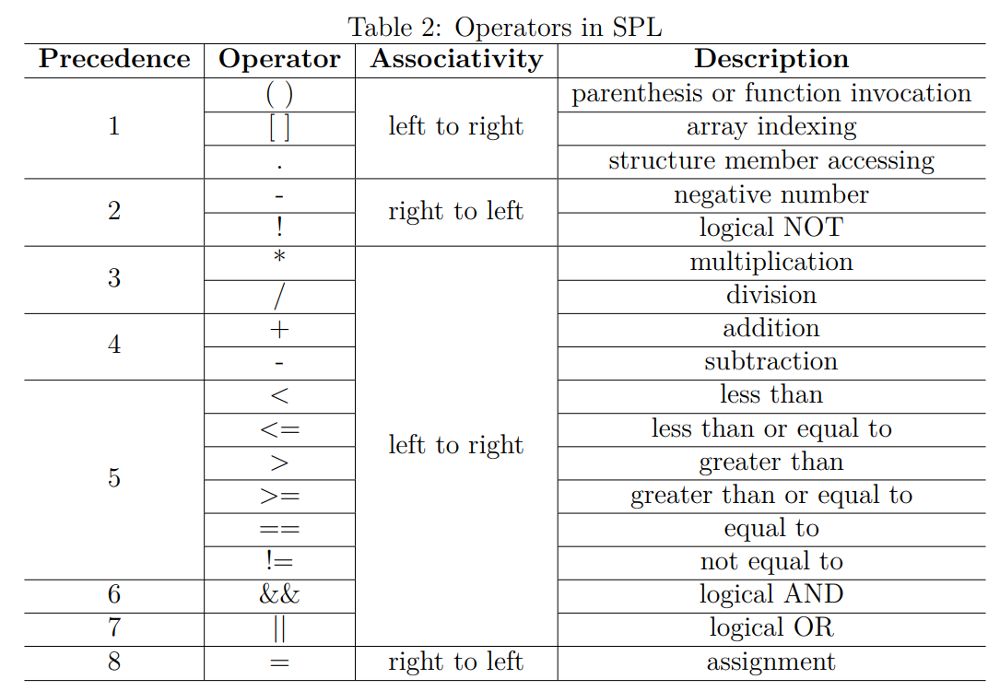

# CS323 Compiler Project Phase 1

## Group Members
| SID      | Name   | Contribution |
| -------- | ------ | ------------ |
| 12011327 | 刘乐奇 | A            |
| 12012801 | 金扬   | A            |
| 12012710 | 黄梓通 | A            |

## Flex：词法分析

在该阶段，我们引入了一个结构体 Node，以方便后续输出抽象语法树。

```c
typedef struct Node
{
    int lineno;
    char *name;

    struct Node *left;
    struct Node *right;

    union
    {
        int int_value;
        float float_value;
        char *string_value;
    };
    char *value_view;

    bool is_leaf;

} Node;

Node *new_interior_node(char *, int, ...);
Node *new_leaf_node(char *, int);
void print_tree(Node *, int);
```

该阶段主要是使用正则表达式来获取相应的 yytext，并加以分析。通过 `Node` 的成员变量，我们可以在后续区分该节点的类型（`name`）、行号（`lineno`）等等。

## Bison：语法分析

在该阶段，对每个 token 都建立了一个 `Node`，但此时的 `Node` 均为内部节点（而词法分析阶段建立的 `Node` 均为叶子节点）。

### 冲突解决

对于 shift/reduce conflict，我们需要利用 `%right`、`%left`、`%prec` 来指定结合顺序和优先级。



### 错误恢复

该部分我们重写了 `yyerror`，使用自定义函数 `yyerror_ow()` 来输出错误。


## 抽象语法树

在词法分析和语法分析阶段我们均建立了抽象语法树的节点 `Node`。不同的是：
1. 词法分析阶段的 `Node` 均为叶子节点，用于表示各种 terminal symbol。只有此类节点的值（`int_value`、`float_value`、`string_value`、`value_view`）有意义。
2. 语法分析阶段的 `Node` 均为内部节点，用于表示各种 non-terminal symbol。该类节点通过 Variadic functions 构造器来建立，因此在实例化时需传入其子节点。

并最终可以使用 `print_tree()` 输出合法程序的抽象语法树。

## 扩展内容

我们实现了单行和多行注释。单行注释即简单地将换行之前的所有字符全部吃完。多行注释使用了 Start Conditions 实现。

```c
/* single */
"//" { char c; while((c=input()) != '\n'); };
/* multi */
<INITIAL> {
    "/*"  BEGIN(COMMENT);
}
<COMMENT> {
    "*/"      BEGIN(INITIAL);
    [^*\n]+   /* eat anything that's not a '*' or EOL */
    "*"       /* eat the lonely '*' */
    \n        ;
}
```

## 测试样例

需要两个 A 类型的错误和两个 B 类型的错误。在 test/ 文件夹下提供了相应的测试样例。

* A 类型错误：test_12011327_3.spl
* B 类型错误：test_12011327_1.spl, test_12011327_5.spl
* 正常：test_12011327_2.spl, test_12011327_4.spl

额外样例在 test_ex/ 文件夹下。
  
## 参考

[Best solution of matching C-style multiple line comments in flex?](https://stackoverflow.com/questions/63498267/best-solution-of-matching-c-style-multiple-line-comments-in-flex)

[Start Conditions](https://westes.github.io/flex/manual/Start-Conditions.html)